<p align="center">
  
</p>

<h1 align="center">📱 Panduan Pengguna</h1>
<h2 align="center">Gateway Config App</h2>
<h3 align="center">Aplikasi Konfigurasi untuk SRT-MGATE-1210 Modbus Gateway IIoT</h3>

<p align="center">
  <strong>Versi Dokumen:</strong> 1.0.0 | <strong>Tanggal:</strong> Desember 2025
</p>

<p align="center">
  <a href="#tentang-aplikasi">Tentang</a> •
  <a href="#persiapan">Persiapan</a> •
  <a href="#koneksi-bluetooth">Koneksi</a> •
  <a href="#konfigurasi-device">Device</a> •
  <a href="#konfigurasi-modbus">Modbus</a> •
  <a href="#konfigurasi-server">Server</a>
</p>

---

## 📋 Daftar Isi

| No | Bagian | Halaman |
|----|--------|---------|
| 1 | [Tentang Aplikasi](#1-tentang-aplikasi) | Pengenalan Gateway Config App |
| 2 | [Persiapan Sebelum Memulai](#2-persiapan-sebelum-memulai) | Kebutuhan dan instalasi |
| 3 | [Menghubungkan ke Gateway](#3-menghubungkan-ke-gateway) | Koneksi Bluetooth ke perangkat |
| 4 | [Dashboard Utama](#4-dashboard-utama) | Navigasi dan menu utama |
| 5 | [Konfigurasi Device (Sensor)](#5-konfigurasi-device-sensor) | Menambah dan mengatur sensor |
| 6 | [Konfigurasi Modbus](#6-konfigurasi-modbus) | Mengatur register data |
| 7 | [Konfigurasi Server](#7-konfigurasi-server) | Pengaturan jaringan dan MQTT |
| 8 | [Status & Monitoring](#8-status--monitoring) | Melihat status gateway |
| 9 | [Streaming Data](#9-streaming-data) | Monitoring data real-time |
| 10 | [Pengaturan Aplikasi](#10-pengaturan-aplikasi) | Settings dan informasi |
| 11 | [Troubleshooting](#11-troubleshooting) | Solusi masalah umum |
| 12 | [Referensi](#12-referensi) | Link dan kontak support |

---

## 1. Tentang Aplikasi

### 🎯 Apa itu Gateway Config App?

**Gateway Config App** adalah aplikasi mobile yang dirancang khusus untuk mengkonfigurasi perangkat **SRT-MGATE-1210 Modbus Gateway IIoT** dari SURIOTA. Aplikasi ini memungkinkan Anda mengatur gateway tanpa perlu laptop atau komputer - cukup gunakan smartphone Anda!

### ✨ Fitur Utama

| Fitur | Deskripsi |
|-------|-----------|
| 🔗 **Koneksi Bluetooth** | Hubungkan ke gateway via Bluetooth Low Energy (BLE) |
| 📡 **Konfigurasi Device** | Tambah dan atur sensor Modbus RTU/TCP |
| 📊 **Setup Register** | Konfigurasi alamat register dan tipe data |
| 🌐 **Setup Jaringan** | Atur WiFi dan Ethernet gateway |
| ☁️ **Setup MQTT/HTTP** | Konfigurasi koneksi ke cloud server |
| 📈 **Streaming Data** | Lihat data sensor secara real-time |
| 💾 **Backup & Restore** | Simpan dan pulihkan konfigurasi |

### 📱 Platform yang Didukung

- **Android:** Versi 5.0 (Lollipop) ke atas
- **iOS:** Versi 12 ke atas

---

## 2. Persiapan Sebelum Memulai

### 📦 Yang Anda Butuhkan

```
✅ Smartphone Android/iOS dengan Bluetooth
✅ Gateway SRT-MGATE-1210 yang sudah terpasang dan menyala
✅ Aplikasi Gateway Config App (dari Play Store/App Store)
✅ Berada dalam jarak 50 meter dari gateway
```

### 📥 Instalasi Aplikasi

#### Untuk Android:
1. Buka **Google Play Store**
2. Cari **"Gateway Config"** atau **"SURIOTA"**
3. Tekan **Install**
4. Tunggu hingga selesai

#### Untuk iOS:
1. Buka **App Store**
2. Cari **"Gateway Config"** atau **"SURIOTA"**
3. Tekan **Get**
4. Tunggu hingga selesai

### ⚙️ Pengaturan Smartphone

Sebelum menggunakan aplikasi, pastikan pengaturan berikut sudah aktif:

| Pengaturan | Status | Cara Mengaktifkan |
|------------|--------|-------------------|
| **Bluetooth** | ✅ ON | Settings → Bluetooth → ON |
| **Lokasi/GPS** | ✅ ON | Settings → Location → ON |
| **Izin Aplikasi** | ✅ Granted | Izinkan akses Bluetooth dan Lokasi saat diminta |

> ⚠️ **Penting:** Beberapa smartphone Android memerlukan GPS aktif untuk scan Bluetooth. Pastikan GPS/Lokasi dalam keadaan menyala.

### 🔌 Persiapan Gateway

Pastikan gateway SRT-MGATE-1210 sudah:

1. ✅ Terhubung ke sumber daya (12-48V DC)
2. ✅ LED Power menyala hijau
3. ✅ LED System berkedip (menandakan gateway aktif)
4. ✅ Berada dalam jangkauan Bluetooth (maksimal 50 meter)

---

## 3. Menghubungkan ke Gateway

### 🔍 Langkah 1: Buka Aplikasi

Buka aplikasi **Gateway Config App** di smartphone Anda. Anda akan melihat halaman **Home** seperti gambar berikut:

.jpeg)

*Gambar 3.1: Halaman Home saat belum ada perangkat terhubung*

Pada halaman ini, Anda akan melihat:
- **Connected Devices** - Daftar perangkat yang pernah terhubung
- **Tombol (+)** - Untuk mencari dan menambah perangkat baru
- **Menu Home & Settings** - Navigasi di bagian bawah

---

### 🔎 Langkah 2: Scan Perangkat

Tekan tombol **(+)** di tengah bawah layar untuk memulai pencarian perangkat.


*Gambar 3.2: Halaman Scan Devices - Tekan tombol Scan*

Tekan tombol **Scan** untuk mulai mencari perangkat gateway di sekitar Anda.

---

### ⏳ Langkah 3: Proses Scanning

Aplikasi akan mencari perangkat Bluetooth di sekitar Anda. Tunggu beberapa detik hingga proses selesai.

.jpeg)

*Gambar 3.3: Proses scanning sedang berlangsung*

---

### 📋 Langkah 4: Pilih Gateway

Setelah scanning selesai, daftar perangkat yang ditemukan akan muncul. Cari perangkat dengan nama **"SURIOTA GW"**.

.jpeg)

*Gambar 3.4: Hasil scan menampilkan daftar perangkat*

**Penjelasan tampilan:**
- **SURIOTA GW** - Nama gateway SURIOTA Anda
- **ID: XX:XX:XX:XX:XX:XX** - Alamat MAC Bluetooth gateway
- **Tombol Connect** - Tekan untuk menghubungkan

> 💡 **Tips:** Jika ada banyak perangkat, gunakan kotak **Search** untuk mencari berdasarkan nama.

---

### ✅ Langkah 5: Koneksi Berhasil

Tekan tombol **Connect** pada perangkat SURIOTA GW. Setelah terhubung, akan muncul dialog konfirmasi.

.jpeg)

*Gambar 3.5: Dialog konfirmasi koneksi berhasil*

Tekan **Yes** untuk membuka halaman detail device.

Setelah terhubung, perangkat akan muncul di halaman Home.


*Gambar 3.6: Gateway berhasil terhubung dan muncul di Home*

**Informasi yang ditampilkan:**
- **Temporary Session** - Peringatan bahwa koneksi bersifat sementara
- **SURIOTA GW** - Nama perangkat
- **ID** - Alamat MAC Bluetooth
- **Last seen** - Waktu terakhir terhubung
- **Tombol Connect** - Untuk masuk ke konfigurasi

---

### 🚀 Langkah 6: Masuk ke Dashboard

Tekan tombol **Connect** pada perangkat yang sudah terhubung untuk masuk ke **Dashboard Gateway**.


*Gambar 3.7: Halaman Detail Device dengan menu konfigurasi*

Halaman **Detail Device** menampilkan:
- **Status BONDED** - Gateway sudah terpasangkan
- **Tombol Disconnect** - Untuk memutuskan koneksi
- **Configuration Menu** - Menu-menu konfigurasi

.jpeg)

*Gambar 3.8: Dashboard utama gateway (versi alternatif)*

🎉 **Selamat!** Anda sudah berhasil terhubung ke gateway. Sekarang Anda dapat mulai mengkonfigurasi perangkat.

---

## 4. Dashboard Utama

### 🏠 Tampilan Dashboard

Setelah terhubung ke gateway, Anda akan melihat dashboard utama dengan berbagai menu konfigurasi.

.jpeg)

*Gambar 4.1: Dashboard utama gateway dengan menu lengkap*

### 📱 Menu yang Tersedia

| Icon | Menu | Fungsi |
|------|------|--------|
| 📡 | **Device Communications** | Menambah dan mengatur sensor/device Modbus |
| 📊 | **Modbus Configurations** | Mengkonfigurasi register data |
| 🌐 | **Server Configurations** | Mengatur jaringan WiFi, Ethernet, MQTT |
| 📈 | **Status** | Melihat status dan informasi gateway |
| 🔄 | **Firmware Update** | Update firmware gateway |
| 💾 | **Backup** | Simpan konfigurasi ke smartphone |
| 📥 | **Restore** | Pulihkan konfigurasi dari backup |
| 🔌 | **Disconnect** | Putuskan koneksi dari gateway |

---

### 🔄 Alur Konfigurasi yang Disarankan

Untuk pengguna baru, ikuti urutan konfigurasi berikut:

```mermaid
flowchart TD
    A[🔗 Hubungkan ke Gateway] --> B[📡 Device Communications]
    B --> C[📊 Modbus Configurations]
    C --> D[🌐 Server Configurations]
    D --> E[📈 Cek Status]
    E --> F[✅ Gateway Siap Digunakan]

    style A fill:#e8f5e9
    style F fill:#e8f5e9
```



**Penjelasan:**
1. **Device Communications** - Daftarkan sensor/device Modbus yang terhubung ke gateway
2. **Modbus Configurations** - Atur alamat register data yang ingin dibaca
3. **Server Configurations** - Setup koneksi jaringan dan server cloud
4. **Status** - Verifikasi semua konfigurasi sudah benar

---

## 5. Konfigurasi Device (Sensor)

### 📡 Apa itu Device Communications?

**Device Communications** adalah menu untuk mendaftarkan dan mengatur sensor atau perangkat Modbus yang terhubung ke gateway. Setiap sensor yang ingin dibaca datanya harus didaftarkan terlebih dahulu di sini.

### 📋 Langkah 1: Buka Menu Device Communications

Dari dashboard, tekan menu **Device Communications**.

.jpeg)

*Gambar 5.1: Halaman Device Communications kosong*

Jika belum ada device yang didaftarkan, halaman akan menampilkan pesan "No device registered".

---

### ➕ Langkah 2: Tambah Device Baru

Tekan tombol **(+)** di pojok kanan atas untuk menambah device baru.


*Gambar 5.2: Form untuk menambah device baru - Mode Modbus RTU*

### 📝 Penjelasan Form Device (Modbus RTU)

| Field | Keterangan | Contoh |
|-------|------------|--------|
| **Device Name** | Nama device (bebas, untuk identifikasi) | `Sensor_Suhu_01` |
| **Slave ID** | Alamat Modbus device (1-247) | `1` |
| **Protocol Selection** | Pilih Modbus RTU atau TCP | `Modbus RTU` |
| **Serial Port** | Port RS485 yang digunakan (1 atau 2) | `2` |
| **Baudrate** | Kecepatan komunikasi | `9600` |
| **Bit Data** | Jumlah bit data | `8` |
| **Parity** | Pengaturan parity | `None` |
| **Stop Bit** | Jumlah stop bit | `1` |

---

### ⚙️ Pengaturan Lanjutan (Advanced Settings)

Scroll ke bawah untuk melihat pengaturan lanjutan.


*Gambar 5.3: Pengaturan lanjutan device*

| Field | Keterangan | Nilai Default |
|-------|------------|---------------|
| **Retry Count** | Jumlah percobaan jika gagal | `3` |
| **Connect Timeout** | Batas waktu koneksi (ms) | `3000` |
| **Refresh Rate** | Interval pembacaan data (ms) | `1000` |

---

### 🌐 Konfigurasi Modbus TCP

Jika device Anda menggunakan **Modbus TCP** (via Ethernet), pilih opsi tersebut.

.jpeg)

*Gambar 5.4: Form device untuk Modbus TCP*

| Field | Keterangan | Contoh |
|-------|------------|--------|
| **IP Address** | Alamat IP device Modbus TCP | `192.168.1.100` |
| **Server Port** | Port Modbus (default 502) | `502` |

.jpeg)

*Gambar 5.5: Pengaturan lanjutan Modbus TCP*

---

### 💾 Langkah 3: Simpan Konfigurasi

Setelah mengisi semua field, tekan tombol **Save Device Configuration** di bagian bawah.

.jpeg)

*Gambar 5.6: Form lengkap siap disimpan*

---

### ✅ Langkah 4: Device Berhasil Ditambahkan

Device yang berhasil ditambahkan akan muncul di daftar.

.jpeg)

*Gambar 5.7: Daftar device yang sudah didaftarkan*

**Fitur pada kartu device:**
- **Toggle Active** - Aktifkan/nonaktifkan device
- **RTU/TCP Badge** - Jenis protokol yang digunakan
- **# Registers** - Jumlah register yang dikonfigurasi
- **View** - Lihat detail device
- **Edit** - Ubah konfigurasi
- **Delete** (🗑️) - Hapus device

---

### ✏️ Edit Device yang Sudah Ada

Untuk mengubah konfigurasi device, tekan tombol **Edit** pada kartu device.

.jpeg)

*Gambar 5.8: Form edit device dengan tombol Update*

Setelah melakukan perubahan, tekan **Update Device Configuration**.

---

## 6. Konfigurasi Modbus

### 📊 Apa itu Modbus Configurations?

**Modbus Configurations** adalah menu untuk mengatur register data yang ingin dibaca dari setiap device. Di sinilah Anda menentukan alamat register, tipe data, dan kalibrasi.

### 📋 Langkah 1: Buka Menu Modbus Configurations

Dari dashboard, tekan menu **Modbus Configurations**.


*Gambar 6.1: Halaman Modbus Configurations*

---

### 🔽 Langkah 2: Pilih Device

Gunakan dropdown **Select Device** untuk memilih device yang ingin dikonfigurasi registernya.

.jpeg)

*Gambar 6.2: Pilih device dari dropdown*

---

### ➕ Langkah 3: Tambah Register Baru

Tekan tombol **(+)** untuk menambah register baru.


*Gambar 6.3: Form setup register Modbus*

### 📝 Penjelasan Form Register

| Field | Keterangan | Contoh |
|-------|------------|--------|
| **Data Name** | Nama data (untuk identifikasi) | `Temperature` |
| **Choose Function** | Function code Modbus | `Input Registers` |
| **Address Modbus** | Alamat register (dimulai dari 0) | `0` |
| **Choose Data Type** | Tipe data register | `Single Register` |

### 📚 Function Code yang Didukung

| Function Code | Nama | Kegunaan |
|---------------|------|----------|
| FC 01 | Read Coils | Baca status digital output |
| FC 02 | Read Discrete Inputs | Baca status digital input |
| FC 03 | Read Holding Registers | Baca register penyimpanan |
| FC 04 | Read Input Registers | Baca register input sensor |

### 📊 Tipe Data yang Didukung

| Tipe Data | Ukuran | Keterangan |
|-----------|--------|------------|
| Single Register | 16-bit | INT16 / UINT16 |
| Float 32-bit | 32-bit | Bilangan desimal |
| Double 64-bit | 64-bit | Presisi tinggi |
| String | Variable | Teks ASCII |

---

### 🔧 Langkah 4: Kalibrasi (Opsional)

Bagian **Calibration Settings** memungkinkan Anda mengkonversi nilai mentah menjadi nilai yang sesuai.

.jpeg)

*Gambar 6.4: Pengaturan kalibrasi register*

| Field | Keterangan | Rumus |
|-------|------------|-------|
| **Scale (Multiplier)** | Pengali nilai | - |
| **Offset** | Penambah setelah skala | - |

**Rumus Kalibrasi:**
```
final_value = (raw_value × scale) + offset
```

**Contoh:**
- Sensor mengeluarkan nilai `100` (dalam 0.1°C)
- Scale: `0.1`, Offset: `0`
- Hasil: `100 × 0.1 + 0 = 10°C`

---

### 💾 Langkah 5: Simpan Register

Tekan **Save Register Configuration** untuk menyimpan.

---

### 📋 Langkah 6: Lihat Daftar Register

Register yang sudah ditambahkan akan muncul di daftar.

.jpeg)

*Gambar 6.5: Daftar register yang sudah dikonfigurasi*

.jpeg)

*Gambar 6.6: Tampilan daftar register dengan detail*

---

## 7. Konfigurasi Server

### 🌐 Apa itu Server Configurations?

**Server Configurations** adalah menu untuk mengatur koneksi jaringan gateway dan pengiriman data ke cloud server.

### 📋 Langkah 1: Buka Menu Server Configurations

Dari dashboard, tekan menu **Server Configurations**.


*Gambar 7.1: Halaman Server Configurations dengan tab-tab pengaturan*

### 📑 Tab yang Tersedia

| Tab | Fungsi |
|-----|--------|
| **Network** | Pengaturan WiFi dan Ethernet |
| **MQTT** | Konfigurasi koneksi MQTT |
| **HTTP** | Konfigurasi koneksi HTTP |

---

### 📶 Tab Network - Pengaturan WiFi

.jpeg)

*Gambar 7.2: Pengaturan jaringan WiFi*

| Field | Keterangan | Contoh |
|-------|------------|--------|
| **WiFi SSID** | Nama jaringan WiFi | `MyWiFi_Network` |
| **WiFi Password** | Password WiFi | `********` |

---

### 🔌 Tab Network - Pengaturan Ethernet

.jpeg)

*Gambar 7.3: Pengaturan Ethernet*

**Mode DHCP (Otomatis):**
- Gateway akan mendapatkan IP secara otomatis dari router

**Mode Static (Manual):**

| Field | Keterangan | Contoh |
|-------|------------|--------|
| **IP Address** | Alamat IP gateway | `192.168.1.100` |
| **Subnet Mask** | Subnet jaringan | `255.255.255.0` |
| **Gateway** | Alamat router | `192.168.1.1` |
| **DNS** | Server DNS | `8.8.8.8` |

---

### ☁️ Tab MQTT - Pengaturan Cloud


*Gambar 7.4: Pengaturan MQTT broker*

| Field | Keterangan | Contoh |
|-------|------------|--------|
| **Broker Address** | URL/IP server MQTT | `mqtt.example.com` |
| **Port** | Port MQTT (1883 atau 8883) | `1883` |
| **Client ID** | Identifier unik gateway | `gateway_001` |
| **Username** | Username MQTT (opsional) | `user123` |
| **Password** | Password MQTT (opsional) | `********` |

---

### 📤 Tab MQTT - Pengaturan Publish

.jpeg)

*Gambar 7.5: Pengaturan publish MQTT*

| Field | Keterangan | Contoh |
|-------|------------|--------|
| **Topic** | Alamat topic publish | `suriota/data` |
| **QoS** | Quality of Service (0/1/2) | `1` |
| **Publish Interval** | Interval pengiriman (ms) | `5000` |

---

### 🔒 Tab MQTT - Pengaturan TLS/SSL

.jpeg)

*Gambar 7.6: Pengaturan keamanan TLS*

Aktifkan **TLS/SSL** untuk koneksi yang aman:
- Port default untuk TLS: `8883`
- Mendukung certificate upload

---

### 💾 Simpan Konfigurasi Server

Tekan tombol **Save** di setiap tab setelah melakukan perubahan.

.jpeg)

*Gambar 7.7: Tombol simpan konfigurasi*

---

### 📝 Form Config Server - Lengkap

Berikut tampilan form konfigurasi server yang menggabungkan pengaturan WiFi dan MQTT:

.jpeg)

*Gambar 7.8: Form konfigurasi server lengkap dengan WiFi dan MQTT*

**Penjelasan Field:**

| Section | Field | Keterangan |
|---------|-------|------------|
| **Internet Settings** | Communication Mode | Pilih WIFI atau Ethernet |
| | WiFi Enabled | Aktifkan koneksi WiFi |
| | WiFi SSID | Nama jaringan WiFi |
| | WiFi Password | Password WiFi |
| **MQTT Protocol** | Enabled | Aktifkan protokol MQTT |
| | Broker Address | Alamat server MQTT |
| | Broker Port | Port MQTT (1883/8883) |

---

### 📊 Logging Configurations

Menu **Logging Configurations** untuk mengatur penyimpanan data lokal pada SD Card.


*Gambar 7.9: Konfigurasi logging data*

**Pengaturan Logging:**

| Pengaturan | Opsi | Keterangan |
|------------|------|------------|
| **Logging Retention** | 1 Week | Simpan log selama 1 minggu |
| | 1 Month | Simpan log selama 1 bulan |
| | 3 Months | Simpan log selama 3 bulan |
| **Logging Interval** | 5 Minutes | Log setiap 5 menit |
| | 10 Minutes | Log setiap 10 menit |
| | 30 Minutes | Log setiap 30 menit |

Tekan **Update Logging Configuration** untuk menyimpan.

---

## 8. Status & Monitoring

### 📈 Melihat Status Gateway

Menu **Status** menampilkan informasi real-time tentang kondisi gateway.


*Gambar 8.1: Halaman status gateway*

### 📊 Informasi yang Ditampilkan

| Informasi | Keterangan |
|-----------|------------|
| **Uptime** | Durasi gateway menyala |
| **Free RAM** | Memory tersisa |
| **WiFi Signal** | Kekuatan sinyal WiFi |
| **IP Address** | Alamat IP gateway |
| **Firmware Version** | Versi firmware saat ini |

---

### 🔄 Firmware Update

Menu **Firmware Update** untuk memperbarui firmware gateway.

.jpeg)

*Gambar 8.2: Halaman firmware update*

**Langkah Update Firmware:**
1. Pastikan gateway terhubung ke internet
2. Tekan **Check for Updates**
3. Jika ada update, tekan **Download & Install**
4. Tunggu proses selesai (jangan matikan gateway!)

---

### 💾 Backup Konfigurasi

Menu **Backup** untuk menyimpan semua konfigurasi ke smartphone.

.jpeg)

*Gambar 8.3: Halaman backup konfigurasi*

**Langkah Backup:**
1. Tekan tombol **Backup Now**
2. Pilih lokasi penyimpanan
3. File backup akan disimpan dalam format JSON

---

### 📥 Restore Konfigurasi

Menu **Restore** untuk mengembalikan konfigurasi dari backup.


*Gambar 8.4: Halaman restore konfigurasi*

**Langkah Restore:**
1. Tekan tombol **Choose File**
2. Pilih file backup (.json)
3. Tekan **Restore**
4. Tunggu proses selesai

---

### 📱 Device Status

Menu **Device Status** menampilkan informasi detail tentang gateway.

.jpeg)

*Gambar 8.5: Halaman Device Status*

| Menu | Fungsi |
|------|--------|
| **Firmware** | Versi firmware saat ini (misal: v1.0.0) |
| **SD Card Info** | Informasi kapasitas SD Card |
| **Update Firmware** | Menu update firmware OTA |

---

### ⚙️ Device Settings

Menu **Device Settings** untuk mengatur konfigurasi gateway.

.jpeg)

*Gambar 8.6: Halaman Device Settings*

| Menu | Fungsi |
|------|--------|
| **Import Config** | Import konfigurasi dari file JSON |
| **Download All Config** | Download semua konfigurasi ke smartphone |
| **Clear Configuration** | Hapus semua konfigurasi (⚠️ Hati-hati!) |

> ⚠️ **Peringatan:** Menu **Clear Configuration** akan menghapus semua konfigurasi gateway. Pastikan Anda sudah melakukan backup sebelum menggunakan fitur ini!

---

## 9. Streaming Data

### 📊 Melihat Data Real-Time

Fitur **Streaming** memungkinkan Anda melihat data sensor secara langsung.

### Langkah 1: Buka Streaming Device

Dari halaman **Device Communications**, tekan tombol **View** pada device yang ingin dilihat datanya.


*Gambar 9.1: Halaman streaming device*

### Langkah 2: Mulai Streaming

Tekan tombol **Stream Data** untuk memulai pembacaan data.


*Gambar 9.2: Proses streaming data*

### Langkah 3: Lihat Data

Data dari register yang dikonfigurasi akan ditampilkan secara real-time.

.jpeg)

*Gambar 9.3: Tampilan data streaming*

**Kontrol Streaming:**
- **Stream Data** - Mulai/lanjutkan streaming
- **Stop Stream** - Hentikan streaming

---

## 10. Pengaturan Aplikasi

### ⚙️ Menu Settings

Tekan tab **Settings** di bagian bawah layar untuk mengakses pengaturan.

.jpeg)

*Gambar 10.1: Halaman Settings*

### 📋 Menu yang Tersedia

| Menu | Fungsi |
|------|--------|
| **Profile** | Lihat informasi profil pengguna |
| **About Product** | Informasi tentang gateway |
| **About App** | Informasi tentang aplikasi |
| **Contact Us** | Kontak dukungan |
| **Logout** | Keluar dari aplikasi |

---

### 👤 My Profile


*Gambar 10.2: Halaman profil pengguna*

---

### ℹ️ About Product

.jpeg)

*Gambar 10.3: Informasi produk gateway*

Halaman ini menampilkan:
- Diagram arsitektur sistem
- Fitur-fitur gateway
- Spesifikasi teknis

---

### 📱 About App

.jpeg)

*Gambar 10.4: Informasi aplikasi*

| Informasi | Keterangan |
|-----------|------------|
| **App Version** | Versi aplikasi saat ini |
| **Author** | Pembuat aplikasi |
| **User Guide** | Link ke panduan pengguna |
| **License** | Informasi lisensi |

---

## 11. Troubleshooting

### ❓ Masalah Umum dan Solusinya

#### 🔴 Gateway tidak ditemukan saat scan

| Kemungkinan Penyebab | Solusi |
|---------------------|--------|
| Bluetooth HP mati | Nyalakan Bluetooth di Settings |
| GPS/Lokasi mati | Nyalakan GPS (diperlukan untuk scan BLE) |
| Jarak terlalu jauh | Dekati gateway (maks. 50 meter) |
| Gateway tidak menyala | Cek sumber daya dan LED Power |

#### 🔴 Gagal connect ke gateway

| Kemungkinan Penyebab | Solusi |
|---------------------|--------|
| Gateway sedang diakses device lain | Tunggu atau putuskan koneksi lain |
| Signal BLE lemah | Dekati gateway |
| Aplikasi hang | Tutup dan buka kembali aplikasi |

#### 🔴 Data Modbus tidak terbaca

| Kemungkinan Penyebab | Solusi |
|---------------------|--------|
| Slave ID salah | Cek dan sesuaikan Slave ID |
| Baudrate tidak cocok | Sesuaikan dengan spesifikasi sensor |
| Kabel RS485 tertukar | Cek koneksi A+ dan B- |
| Alamat register salah | Verifikasi alamat di manual sensor |

#### 🔴 Gateway tidak terkoneksi ke WiFi

| Kemungkinan Penyebab | Solusi |
|---------------------|--------|
| SSID/Password salah | Periksa kembali kredensial |
| Sinyal WiFi lemah | Pindahkan gateway lebih dekat ke router |
| WiFi 5GHz | Gateway hanya support WiFi 2.4GHz |

#### 🔴 Data tidak terkirim ke MQTT

| Kemungkinan Penyebab | Solusi |
|---------------------|--------|
| Broker address salah | Periksa URL/IP broker |
| Port salah | Gunakan 1883 (non-TLS) atau 8883 (TLS) |
| Username/Password salah | Periksa kredensial MQTT |
| Gateway tidak terkoneksi internet | Cek koneksi jaringan |

---

### 🔦 Panduan LED Indikator

| LED | Warna | Status | Arti |
|-----|-------|--------|------|
| **PWR** | 🟢 Hijau | Menyala | Power normal |
| **PWR** | 🔴 Merah | Menyala | Error power |
| **SYS** | 🟢 Hijau | Berkedip | Sistem berjalan normal |
| **SYS** | 🔴 Merah | Menyala | Sistem error |
| **NET** | 🔵 Biru | Berkedip | Mencoba koneksi |
| **NET** | 🔵 Biru | Menyala | Terkoneksi |
| **RS485** | 🟡 Kuning | Berkedip | Ada aktivitas data |

---

## 12. Referensi

### 🔗 Link Penting

| Resource | Link |
|----------|------|
| 🌐 Website Resmi | [www.suriota.com](https://www.suriota.com) |
| 📖 Dokumentasi | [docs.suriota.com/gateway](https://docs.suriota.com/gateway) |
| 🎥 Video Tutorial | [YouTube @suriota.official](https://youtube.com/@suriota.official) |
| 📸 Instagram | [@suriota.official](https://instagram.com/suriota.official) |
| 💼 LinkedIn | [SURIOTA](https://linkedin.com/company/suriota) |

---

### 📞 Kontak Dukungan

**PT Surya Inovasi Prioritas (SURIOTA)**

| Kontak | Detail |
|--------|--------|
| 📍 **Alamat** | Batam Centre, Jl. Legenda Malaka, Baloi Permai, Kec. Batam Kota, Kota Batam, Kepulauan Riau 29431 |
| 📞 **Telepon** | 0858-3567-2476 |
| 📱 **WhatsApp** | +62 858-3567-2476 |
| 📧 **Email** | support@suriota.com |

---

### ⏰ Jam Operasional Support

| Hari | Jam |
|------|-----|
| Senin - Jumat | 08:00 - 17:00 WIB |
| Sabtu | 08:00 - 12:00 WIB |
| Minggu & Hari Libur | Tutup |

---

## 📄 Informasi Dokumen

| Item | Detail |
|------|--------|
| **Judul** | Panduan Pengguna Gateway Config App |
| **Versi** | 1.0.0 |
| **Tanggal** | Desember 2025 |
| **Author** | SURIOTA R&D Team |
| **AI Assistant** | Claude (Anthropic) |

---

---

## 📎 Lampiran: Daftar Screenshot

Berikut adalah daftar lengkap 46 screenshot yang digunakan dalam panduan ini:

### A. Koneksi & Home (8 Screenshot)

| No | File | Deskripsi |
|----|------|-----------|
| 1 | `WhatsApp Image 2025-11-30 at 15.08.31 (2).jpeg` | Home - No Device |
| 2 | `WhatsApp Image 2025-11-30 at 15.08.30.jpeg` | Scan Devices - Find Device |
| 3 | `WhatsApp Image 2025-11-30 at 15.08.29 (2).jpeg` | Scanning Process |
| 4 | `WhatsApp Image 2025-11-30 at 15.08.29 (3).jpeg` | Scan Results |
| 5 | `WhatsApp Image 2025-11-30 at 15.08.29 (1).jpeg` | Connection Dialog |
| 6 | `WhatsApp Image 2025-11-30 at 15.08.13.jpeg` | Home - Connected Device |
| 7 | `WhatsApp Image 2025-11-30 at 15.08.29.jpeg` | Detail Device Menu |
| 8 | `WhatsApp Image 2025-11-30 at 15.08.13 (1).jpeg` | Dashboard |

### B. Device Communications (8 Screenshot)

| No | File | Deskripsi |
|----|------|-----------|
| 9 | `WhatsApp Image 2025-11-30 at 15.08.13 (2).jpeg` | Dashboard Overview |
| 10 | `WhatsApp Image 2025-11-30 at 15.08.13 (3).jpeg` | Device Communications Empty |
| 11 | `WhatsApp Image 2025-11-30 at 15.08.21.jpeg` | Form Setup Device - RTU |
| 12 | `WhatsApp Image 2025-11-30 at 15.08.19.jpeg` | Form Setup Device - Advanced |
| 13 | `WhatsApp Image 2025-11-30 at 15.08.20.jpeg` | Form Setup Device - RTU Filled |
| 14 | `WhatsApp Image 2025-11-30 at 15.08.20 (2).jpeg` | Form Setup Device - TCP |
| 15 | `WhatsApp Image 2025-11-30 at 15.08.20 (1).jpeg` | Form Setup Device - TCP Advanced |
| 16 | `WhatsApp Image 2025-11-30 at 15.08.20 (3).jpeg` | Form Setup Device - Complete |

### C. Device List & Edit (4 Screenshot)

| No | File | Deskripsi |
|----|------|-----------|
| 17 | `WhatsApp Image 2025-11-30 at 15.08.21 (1).jpeg` | Device List |
| 18 | `WhatsApp Image 2025-11-30 at 15.08.17 (1).jpeg` | Edit Device Form |
| 19 | `WhatsApp Image 2025-11-30 at 15.08.14.jpeg` | Streaming Device |
| 20 | `WhatsApp Image 2025-11-30 at 15.08.17.jpeg` | Processing Data |

### D. Modbus Configurations (5 Screenshot)

| No | File | Deskripsi |
|----|------|-----------|
| 21 | `WhatsApp Image 2025-11-30 at 15.08.22.jpeg` | Modbus Config Page |
| 22 | `WhatsApp Image 2025-11-30 at 15.08.22 (1).jpeg` | Select Device Dropdown |
| 23 | `WhatsApp Image 2025-11-30 at 15.08.23.jpeg` | Setup Modbus Form |
| 24 | `WhatsApp Image 2025-11-30 at 15.08.21 (2).jpeg` | Calibration Settings |
| 25 | `WhatsApp Image 2025-11-30 at 15.08.23 (1).jpeg` | Register List |
| 26 | `WhatsApp Image 2025-11-30 at 15.08.23 (2).jpeg` | Register List Expanded |

### E. Server Configurations (9 Screenshot)

| No | File | Deskripsi |
|----|------|-----------|
| 27 | `WhatsApp Image 2025-11-30 at 15.08.24.jpeg` | Server Config Menu |
| 28 | `WhatsApp Image 2025-11-30 at 15.08.24 (1).jpeg` | Network - WiFi Settings |
| 29 | `WhatsApp Image 2025-11-30 at 15.08.24 (2).jpeg` | Network - Ethernet Settings |
| 30 | `WhatsApp Image 2025-11-30 at 15.08.25.jpeg` | MQTT Settings |
| 31 | `WhatsApp Image 2025-11-30 at 15.08.25 (1).jpeg` | MQTT Publish Settings |
| 32 | `WhatsApp Image 2025-11-30 at 15.08.25 (2).jpeg` | MQTT TLS Settings |
| 33 | `WhatsApp Image 2025-11-30 at 15.08.25 (3).jpeg` | Save Server Config |
| 34 | `WhatsApp Image 2025-11-30 at 15.08.27 (2).jpeg` | Form Config Server Complete |
| 35 | `WhatsApp Image 2025-11-30 at 15.08.28.jpeg` | Logging Config |

### F. Status & Monitoring (6 Screenshot)

| No | File | Deskripsi |
|----|------|-----------|
| 36 | `WhatsApp Image 2025-11-30 at 15.08.26.jpeg` | Status Page |
| 37 | `WhatsApp Image 2025-11-30 at 15.08.26 (1).jpeg` | Firmware Update |
| 38 | `WhatsApp Image 2025-11-30 at 15.08.26 (2).jpeg` | Backup Page |
| 39 | `WhatsApp Image 2025-11-30 at 15.08.27.jpeg` | Restore Page |
| 40 | `WhatsApp Image 2025-11-30 at 15.08.28 (1).jpeg` | Device Status |
| 41 | `WhatsApp Image 2025-11-30 at 15.08.28 (2).jpeg` | Device Settings |

### G. Streaming Data (2 Screenshot)

| No | File | Deskripsi |
|----|------|-----------|
| 42 | `WhatsApp Image 2025-11-30 at 15.08.14.jpeg` | Streaming Device |
| 43 | `WhatsApp Image 2025-11-30 at 15.08.27 (1).jpeg` | Streaming Data View |

### H. Settings & About (4 Screenshot)

| No | File | Deskripsi |
|----|------|-----------|
| 44 | `WhatsApp Image 2025-11-30 at 15.08.31 (1).jpeg` | Settings Page |
| 45 | `WhatsApp Image 2025-11-30 at 15.08.31.jpeg` | My Profile |
| 46 | `WhatsApp Image 2025-11-30 at 15.08.30 (2).jpeg` | About Product |
| 47 | `WhatsApp Image 2025-11-30 at 15.08.30 (1).jpeg` | About App |

---

## 📊 Ringkasan Fitur per Screenshot

```
📱 Total Screenshot: 46
├── 🔗 Koneksi & Home: 8
├── 📡 Device Communications: 8
├── ✏️ Device List & Edit: 4
├── 📊 Modbus Configurations: 5
├── 🌐 Server Configurations: 9
├── 📈 Status & Monitoring: 6
├── 📺 Streaming Data: 2
└── ⚙️ Settings & About: 4
```

---

<p align="center">
  <strong>© 2025 PT Surya Inovasi Prioritas (SURIOTA)</strong><br>
  All Rights Reserved
</p>

<p align="center">
  <em>Empowering Industrial IoT Solutions</em>
</p>

<p align="center">
  📱 Dokumen ini dibuat dengan bantuan <strong>Claude AI</strong> dari Anthropic
</p>

---

<p align="center">
  <a href="#-panduan-pengguna">⬆️ Kembali ke Atas</a>
</p>
